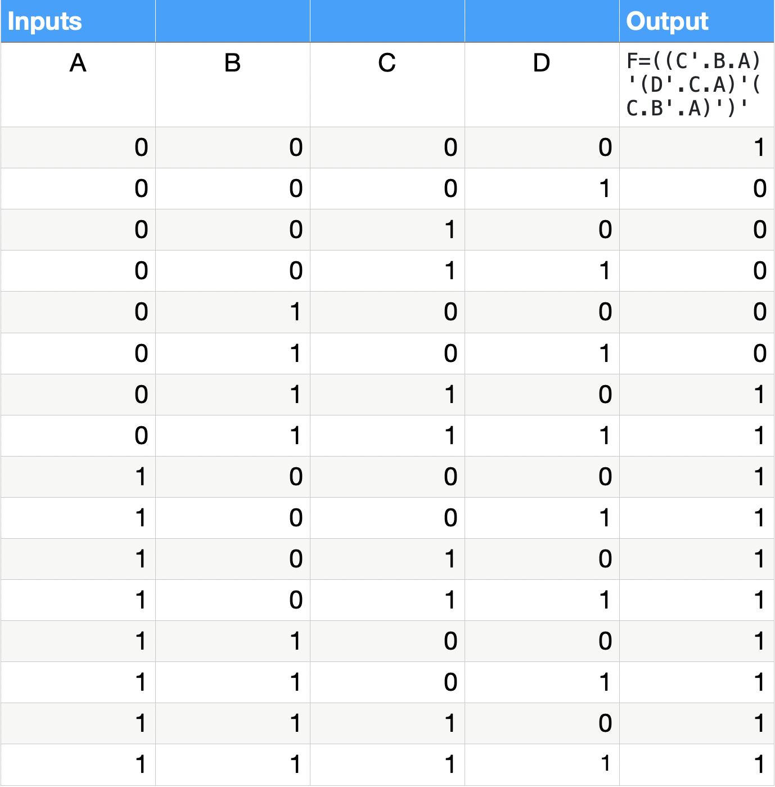
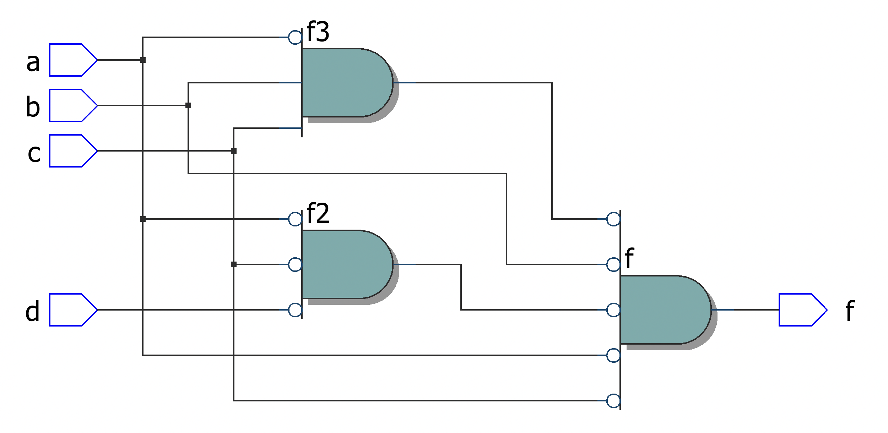
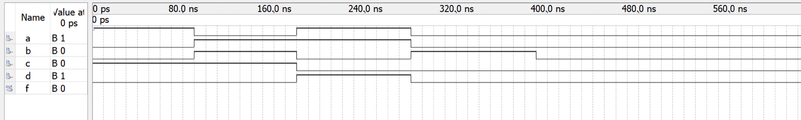
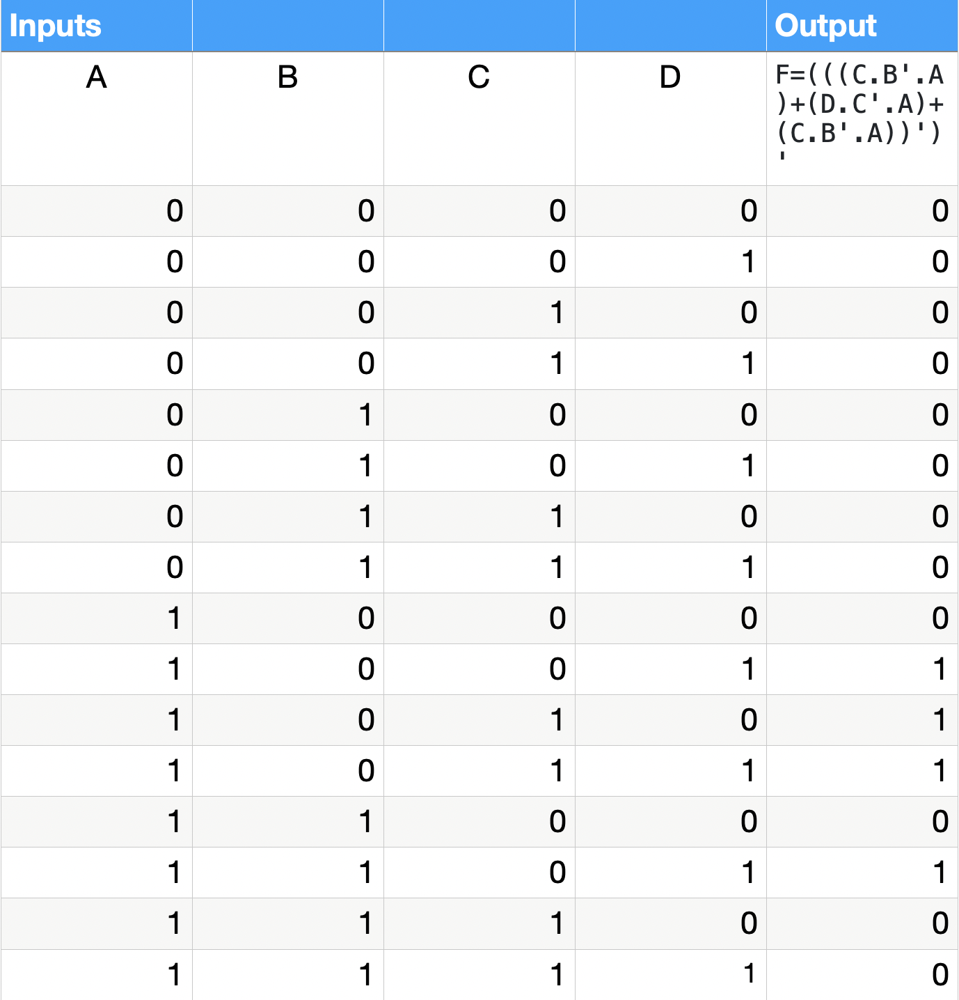
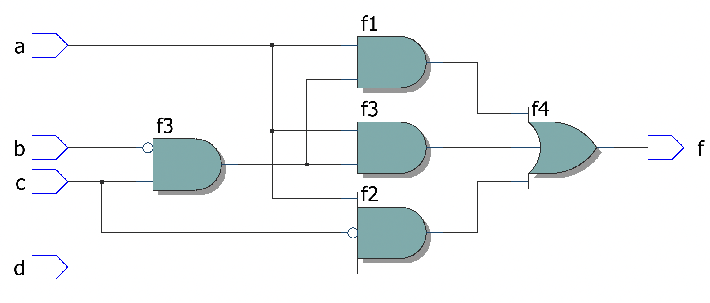
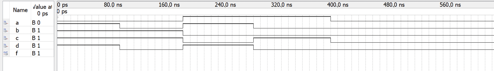

# Experiment--04-Implementation-of-combinational-logic-using-universal-gates-
 ## Implementation-of-Half-subtractor-and-Full-subtractor-circuit
## AIM:
To implement the given logic function using NAND and NOR gates and to verify its operation in Quartus using Verilog programming.
F=((C'.B.A)'(D'.C.A)'(C.B'.A)')' using NAND gate
F=(((C.B'.A)+(D.C'.A)+(C.B'.A))')' using NOR gate


## Equipments Required:
## Hardware – PCs, Cyclone II , USB flasher
## Software – Quartus prime
## Theory
 
## Procedure


### Step1:- Open Quartus software and create a new project.

### Step2:- Create a new verilog hdl programming file.

### Step3:- Start the programming with module name as the name of the file.

### Step4:- Declare the inputs F=((C'.B.A)'(D'.C.A)'(C.B'.A)')' and F=(((C.B'.A)+(D.C'.A)+(C.B'.A))')' , for NAND and NOR gates.

### Step5:- After creating the required program end the module.

### Step6:- Run RTL simulation to get the logic diagram output.

### Step7:- Create a new verilog programming file for creating the timing diagram.

### Step8:- In the created file insert node bus and list all the logics and create wave form.

### Step9:- End the process.


## Program:
/*
Program to design a Implementation of combinational logic using universal gates-  and verify its truth table in quartus using Verilog programming.
Developed by: Sai Eswar Kandukuri
RegisterNumber:  212221240020

```
USING NAND
module EX4_1(a,b,c,d,f);
input a,b,c,d;
output f;
wire f1,f2,f3;
assign f1 = (~c&~b&~a);
assign f2 = (~d&~c&~a);
assign f3 = (c&~(~b)&~a);
assign f= f1&~f2&~f3;
endmodule


USING NOR
module EX4_2(a,b,c,d,f);
input a,b,c,d;
output f;
wire f1,f2,f3,f4;
assign f1 = c&(~b)&a;
assign f2 = d&(~c)&a;
assign f3 = c&(~b)&a;
assign f4 = ~(f1|f2|f3);
not(f,f4);
endmodule


```
*/

## Output:

### Function 1:

## Truthtable


##  RTL realization


## Timing diagram 


### Function 2:

## Truthtable


##  RTL realization


## Timing diagram 


## Result:
 
Thus implementation of logic functions using NAND and NOR gates is done and its operation is verified in Quartus using Verilog programming.
